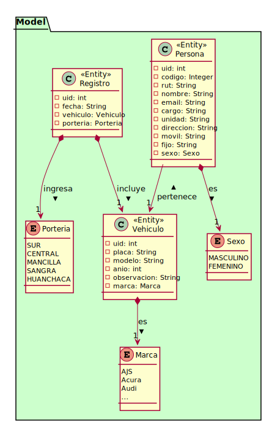

# The Parking Project

<p align="center"></p>

* **Course**: DAIS-00720 Proyecto de Desarrollo e Integración de Soluciones.
* **Semester**: 202010.
* **Program**: Ingeniería en Computación e Informática.
* **University**: Universidad Católica del Norte, Antofagasta, Chile.

## Techstack

* [Java OpenJDK 11](https://openjdk.java.net/projects/jdk/11/).
* [Jetbrains IntelliJ](https://www.jetbrains.com/idea/nextversion/).
* [Gradle](https://gradle.org/).
* [ZeroIce](https://zeroc.com/).
* [PHP](https://www.php.net/).
* [Laravel Framework](https://laravel.com/).
* [.NET Core](https://dotnet.microsoft.com/).
* [EntityFramework Core](https://docs.microsoft.com/en-us/ef/core/).
* [Jetbrains Rider](https://www.jetbrains.com/rider/nextversion/).
* [SQLite](https://www.sqlite.org/).
* [Kotlin](https://developer.android.com/kotlin).
* [Android Studio Preview](https://developer.android.com/studio/preview).

## Domain Model



<details><summary>PlantUML</summary>
<p>

```
@startuml

package Model {

    class Persona <<Entity>> {
        - uid: int
        - codigo: Integer
        - rut: String
        - nombre: String
        - email: String
        - cargo: String
        - unidad: String
        - direccion: String
        - movil: String
        - fijo: String
        - sexo: Sexo
    }

    enum Sexo {
        MASCULINO
        FEMENINO
    }
    Persona --> Sexo

    enum Marca {
        AJS
        Acura
        Audi
        ...
    }

    class Vehiculo <<Entity>> {
        - uid: int
        - placa: String
        - modelo: String
        - anio: int
        - observacion: String
        - marca: Marca
    }
    Vehiculo --> Marca
    Persona --> Vehiculo

    enum Porteria {
        SUR
        CENTRAL
        MANCILLA
        SANGRA
        HUANCHACA
    }

    class Registro <<Entity>> {
        - uid: int
        - fecha: String
        - vehiculo: Vehiculo
        - porteria: Porteria
    }
    Registro --> Porteria
    Registro --> Vehiculo

}

@enduml
```

</p>
</details>

## License
[MIT](https://choosealicense.com/licenses/mit/)
