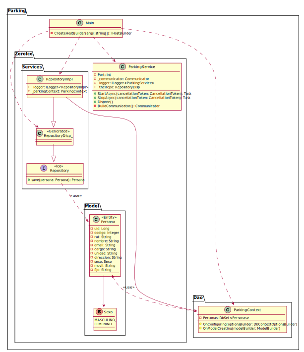

# Parking Project: Backend

* **Tech**: .NET Core + EntityFramework Core.

## .NET Libraries

* [Microsoft.EntityFrameworkCore](https://www.nuget.org/packages/Microsoft.EntityFrameworkCore/)
* [Microsoft.EntityFrameworkCore.Sqlite](https://www.nuget.org/packages/Microsoft.EntityFrameworkCore.Sqlite/)
* [Microsoft.Extensions.Hosting](https://www.nuget.org/packages/Microsoft.Extensions.Hosting/)
* [Microsoft.Extensions.DependencyInjection](https://www.nuget.org/packages/Microsoft.Extensions.DependencyInjection/)
* [Microsoft.Extensions.Logging](https://www.nuget.org/packages/Microsoft.Extensions.Logging/)
* [Microsoft.Extensions.Logging.Console](https://www.nuget.org/packages/Microsoft.Extensions.Logging.Console/)
* [zeroc.ice.net](https://www.nuget.org/packages/zeroc.ice.net/)
* [zeroc.icebuilder.msbuild](https://www.nuget.org/packages/zeroc.icebuilder.msbuild/)

## Class Diagram



<details><summary>PlantUML</summary>
<p>

```
@startuml

package Parking {


    package Dao {
    
        class ParkingContext {
            - Personas: DbSet<Personas>
            # OnConfiguring(optionsBuilder: DbContextOptionsBuilder)
            # OnModelCreating(modelBuilder: ModelBuilder)
        }
    
    }

    package ZeroIce {

        package Model {
        
            class Persona <<Entity>> {
                - uid: Long
                - codigo: Integer
                - rut: String
                - nombre: String
                - email: String
                - cargo: String
                - unidad: String
                - direccion: String
                - sexo: Sexo
                - movil: String
                - fijo: String
            }
            Persona <.. ParkingContext: <<use>>
        
            enum Sexo {
                MASCULINO,
                FEMENINO
            }
            Persona --> Sexo
                
        }
        
        class ParkingService {
            - Port: int
            - _communicator: Communicator 
            - _logger: ILogger<ParkingService>
            - _theRepo: RepositoryDisp_
            + StartAsync(cancellationToken: CancellationToken): Task
            + StopAsync(cancellationToken: CancellationToken): Task
            + Dispose()
            - BuildCommunicator(): Communicator
        }
    
        package Services {
        
            interface Repository <<Ice>> {
                + save(persona: Persona): Persona
            }
            Repository ..> Persona: <<use>>       
 
            class RepositoryDisp_ <<Generated>> {
            }
            RepositoryDisp_ --|> Repository
        
            class RepositoryImpl {
                - _logger: ILogger<RepositoryImpl>
                - _parkingContext: ParkingContext
            }
            RepositoryImpl --> ParkingContext
            RepositoryImpl --|> RepositoryDisp_
        
        }
        
    }

    class Main {
        - CreateHostBuilder(args: string[]): IHostBuilder 
    }
    Main ..> ParkingService
    Main ..> ParkingContext
    Main ..> RepositoryImpl
    Main ..> RepositoryDisp_

}

@enduml
```

</p>
</details>
