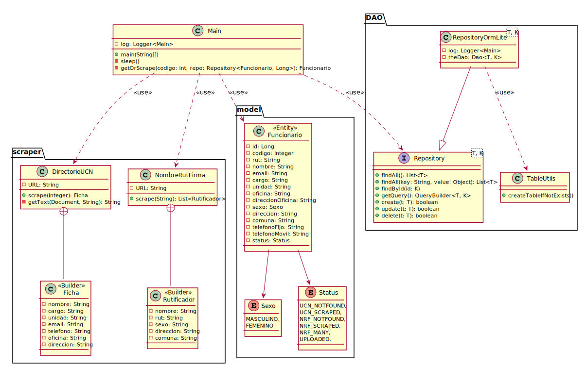

# Parking Project: Scraper

* **Tech**: Java JDK + Jsoup + ZeroIce.
* **Source**: [Búsqueda Directorio](http://online.ucn.cl/directoriotelefonicoemail/Default.aspx).
* **Source**: [Nombre Rut y Firma - Rutificador](https://www.nombrerutyfirma.com/).

## Java Libraries

* SLF4J: [org.slf4j:slf4j-api](https://mvnrepository.com/artifact/org.slf4j/slf4j-api).
* Logback: [ch.qos.logback:logback-classic](https://mvnrepository.com/artifact/ch.qos.logback/logback-classic).
* Jsoup: [org.jsoup:jsoup](https://mvnrepository.com/artifact/org.jsoup/jsoup).
* Gson: [com.google.code.gson:gson](https://mvnrepository.com/artifact/com.google.code.gson/gson).
* Lombok: [org.projectlombok:lombok](https://mvnrepository.com/artifact/org.projectlombok/lombok).
* Javax.Persistence: [javax.persistence:javax.persistence-api](https://mvnrepository.com/artifact/javax.persistence/javax.persistence-api).
* Commons-lang: [org.apache.commons:commons-lang3](https://mvnrepository.com/artifact/org.apache.commons/commons-lang3).
* JPA: [javax.persistence:javax.persistence-api](https://mvnrepository.com/artifact/javax.persistence/javax.persistence-api).
* JUnit: [org.junit.jupiter:junit-jupiter](https://mvnrepository.com/artifact/org.junit.jupiter/junit-jupiter-api).
* ZeroIce: [com.zeroc:ice](https://mvnrepository.com/artifact/com.zeroc/ice).
* ORMLite: [com.j256.ormlite:ormlite-core](https://mvnrepository.com/artifact/com.j256.ormlite/ormlite-core).

## Class Diagram



<details><summary>PlantUML</summary>
<p>

```
@startuml

class Main {
    {static} - log: Logger<Main>
    {static} + main(String[])
    {static} - sleep()
    {static} - getOrScrape(codigo: int, repo: Repository<Funcionario, Long>): Funcionario
}

package scraper {
    class DirectorioUCN {
        {static} - URL: String
        {static} + scrape(Integer): Ficha
        {static} - getText(Document, String): String
    }
    
    class Ficha <<Builder>> {
        - nombre: String
        - cargo: String
        - unidad: String
        - email: String
        - telefono: String
        - oficina: String
        - direccion: String
    }
    
    class NombreRutFirma {
        {static} - URL: String
        {static} + scrape(String): List<Rutificador>
    }
    
    class Rutificador <<Builder>> {
        - nombre: String
        - rut: String
        - sexo: String
        - direccion: String
        - comuna: String
    }

    NombreRutFirma +-- Rutificador
    DirectorioUCN +-- Ficha
}

package model {
    class Funcionario <<Entity>> {
        - id: Long
        - codigo: Integer
        - rut: String
        - nombre: String
        - email: String
        - cargo: String
        - unidad: String
        - oficina: String
        - direccionOficina: String
        - sexo: Sexo
        - direccion: String
        - comuna: String
        - telefonoFijo: String
        - telefonoMovil: String
        - status: Status
    }

    enum Sexo {
        MASCULINO,
        FEMENINO
    }
    
    enum Status {
        UCN_NOTFOUND,
        UCN_SCRAPED,
        NRF_NOTFOUND,
        NRF_SCRAPED,
        NRF_MANY,
        UPLOADED,
    }

    Funcionario --> Sexo
    Funcionario --> Status
}

package DAO {
    interface Repository<T, K> {
        + findAll(): List<T>
        + findAll(key: String, value: Object): List<T>
        + findById(id: K)
        + getQuery(): QueryBuilder<T, K>
        + create(t: T): boolean
        + update(t: T): boolean
        + delete(t: T): boolean
    }
    
    class RepositoryOrmLite<T, K> {
        {static} - log: Logger<Main>
        - theDao: Dao<T, K>
    }

    class TableUtils {
        {static} + createTableIfNotExists()
    }
    
    RepositoryOrmLite --|> Repository
    RepositoryOrmLite ..> TableUtils: <<use>>
}

Main ..> DirectorioUCN: <<use>>
Main ..> NombreRutFirma: <<use>>
Main ..> Funcionario: <<use>>
Main ..> Repository: <<use>>

@enduml
```

</p>
</details>
